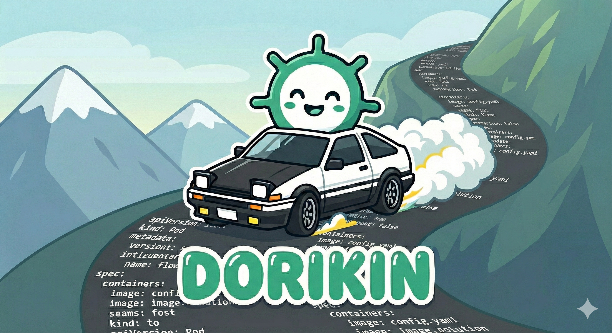

<p align="center">
  
</p>

<p align="center">
  <strong>Kubernetes Configuration Drift Detector</strong><br>
  <em>"You call that drifting?"</em><br>
  
</p>

<p align="center">
  <a href="#features">Features</a> •
  <a href="#installation">Installation</a> •
  <a href="#usage">Usage</a> •
  <a href="#tui-controls">TUI Controls</a> •
  <a href="docs/drift-detection.md">How It Works</a> •
  <a href="#roadmap">Roadmap</a>
</p>

---

## Overview

Dorikin compares your desired Kubernetes manifests against actual cluster state, detecting configuration drift in real-time. It provides both a CLI for scripting and CI/CD integration, and an interactive TUI for exploration and debugging.

<p align="center">
  
</p>

> **[How Drift Detection Works](docs/drift-detection.md)** — Deep dive into the comparison algorithm, field filtering, limitations, and best practices.

**Drift Types Detected:**

| Status | Description |
|--------|-------------|
| `IN_SYNC` | Resource matches manifest |
| `DRIFTED` | Resource exists but fields differ from manifest |
| `MISSING` | Resource defined in manifest but absent from cluster |
| `EXTRA` | Resource exists in cluster but not in manifests |
| `ERROR` | Resource couldn't be fetched or compared |

## Features

- **Real-time drift detection** — Compare YAML manifests against live cluster state
- **Interactive TUI** — Navigate resources, view detailed diffs, filter by status
- **Auto-refresh** — Continuously monitor for drift with configurable intervals
- **Smart field filtering** — Ignores Kubernetes-managed fields (status, metadata.uid, etc.)
- **HPA-aware** — Automatically skips replica comparison for HPA-managed resources
- **Quantity normalization** — Treats equivalent values as equal (`128Mi` = `134217728`, `500m` = `0.5`)
- **Content-based matching** — Matches arrays by key field (containers by name, not index)
- **Helm support** — Scan Helm charts directly with values and set overrides
- **Kustomize support** — Scan Kustomize overlays directly
- **Multi-format output** — Table, JSON, YAML, or quiet mode for CI/CD
- **Recursive scanning** — Process entire manifest directories
- **Context-aware** — Works with any kubeconfig context

## Installation

### From Source

```bash
git clone https://github.com/indrasvat/dorikin.git
cd dorikin
make build
```

Binary will be available at `./bin/dorikin`.

### Requirements

- Go 1.25+
- Access to a Kubernetes cluster (via kubeconfig)

## Usage

### CLI Scan

```bash
# Scan a directory of manifests
dorikin scan ./manifests/

# Scan specific files
dorikin scan -f deployment.yaml -f service.yaml

# Scan with a specific context
dorikin scan -c production ./manifests/

# Filter by namespace
dorikin scan -n my-namespace ./manifests/

# Output as JSON (for CI/CD)
dorikin scan -o json ./manifests/

# Quiet mode (exit code only)
dorikin scan -o quiet ./manifests/
```

### Helm Charts

```bash
# Scan a Helm chart
dorikin scan --helm ./charts/myapp/

# With custom release name and namespace
dorikin scan --helm ./charts/myapp/ --helm-release production -n prod

# With values files and --set overrides
dorikin scan --helm ./charts/myapp/ --helm-values values-prod.yaml --helm-set image.tag=v1.2.3
```

### Kustomize Overlays

```bash
# Scan a Kustomize overlay
dorikin scan --kustomize ./k8s/overlays/production/

# With namespace filter
dorikin scan --kustomize ./k8s/overlays/production/ -n my-namespace
```

### Interactive TUI

```bash
# Launch TUI
dorikin ui ./manifests/

# With custom refresh interval (seconds)
dorikin ui --refresh-interval 10 ./manifests/

# With specific context
dorikin ui -c staging ./manifests/
```

### Exit Codes

| Code | Meaning |
|------|---------|
| `0` | All resources in sync |
| `1` | Drift detected |
| `2` | Error during scan |

## CLI Reference

### Global Flags

| Flag | Short | Description |
|------|-------|-------------|
| `--kubeconfig` | `-k` | Path to kubeconfig file |
| `--context` | `-c` | Kubernetes context to use |

### Scan Command

```bash
dorikin scan [flags] [paths...]
```

| Flag | Short | Description |
|------|-------|-------------|
| `--file` | `-f` | Manifest file or directory (repeatable) |
| `--namespace` | `-n` | Filter by namespace |
| `--output` | `-o` | Output format: `table`, `json`, `yaml`, `quiet` |
| `--recursive` | `-R` | Recursively scan directories (default: true) |
| `--ignore` | | Field paths to ignore during comparison |
| `--hpa-aware` | | HPA awareness: `manifests` (default), `cluster`, `disabled` |
| `--helm` | | Load manifests from Helm chart |
| `--helm-release` | | Helm release name (default: `release`) |
| `--helm-values` | | Helm values files (repeatable) |
| `--helm-set` | | Helm --set values (repeatable) |
| `--kustomize` | | Load manifests from Kustomize directory |

### UI Command

```bash
dorikin ui [flags] [paths...]
```

| Flag | Short | Description |
|------|-------|-------------|
| `--file` | `-f` | Manifest file or directory (repeatable) |
| `--namespace` | `-n` | Filter by namespace |
| `--recursive` | `-R` | Recursively scan directories (default: true) |
| `--refresh-interval` | | Auto-refresh interval in seconds (default: 5) |
| `--ignore` | | Field paths to ignore during comparison |
| `--hpa-aware` | | HPA awareness: `manifests` (default), `cluster`, `disabled` |
| `--helm` | | Load manifests from Helm chart |
| `--helm-release` | | Helm release name (default: `release`) |
| `--helm-values` | | Helm values files (repeatable) |
| `--helm-set` | | Helm --set values (repeatable) |
| `--kustomize` | | Load manifests from Kustomize directory |

## TUI Controls

| Key | Action |
|-----|--------|
| `↑` / `k` | Navigate up |
| `↓` / `j` | Navigate down |
| `Enter` / `l` | View resource details |
| `Esc` / `h` | Go back |
| `f` | Cycle status filter |
| `o` | Toggle IN_SYNC visibility |
| `r` | Manual refresh |
| `a` | Toggle auto-refresh |
| `?` | Show help |
| `q` | Quit |

## Test Track

A local Kubernetes testing environment is included for development and demos. Requires [Colima](https://github.com/abiosoft/colima).

```bash
make track-setup    # Create test environment
make track-scan     # Run drift scan
make track-tui      # Launch interactive TUI
make track-drift    # Apply drift scenarios
make track-reset    # Reset to baseline
make track-cleanup  # Tear down environment
```

## Roadmap

Potential future enhancements:

- **Webhook notifications** — Alert on drift via Slack, PagerDuty, or custom webhooks
- **Prometheus metrics** — Expose drift metrics for monitoring dashboards
- **Drift remediation** — Apply manifests to sync cluster state
- **Historical tracking** — Track drift over time with trend analysis
- **Multi-cluster scanning** — Compare state across clusters
- **Policy rules** — Define acceptable drift thresholds per resource type
- **Git integration** — Compare cluster state against Git branches

---

## License

Apache 2.0
